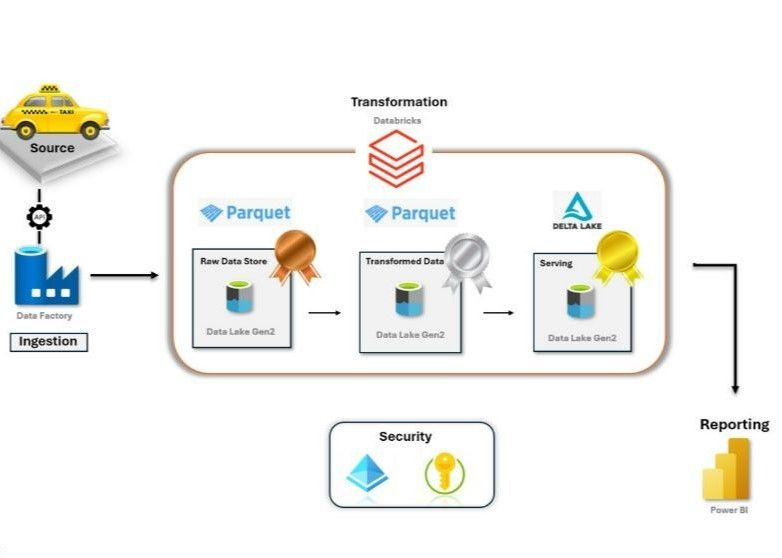

# NYC Taxi Azure Data Engineering Project

## Project Overview

This project follows the Medallion Architecture (Bronze, Silver, Gold) to process and analyze NYC Taxi data using Azure services. The workflow consists of data ingestion, transformation, storage, and reporting using Azure Data Factory (ADF), Azure Databricks, Azure Data Lake Storage Gen2, and Power BI.

## Architecture Overview 



### Architecture

- Data Ingestion: Azure Data Factory (ADF) ingests raw data from an online source.

- Data Transformation: Azure Databricks processes raw data stored in the Bronze layer, transforms it, and loads it into the Silver layer.

- Data Serving: The Gold layer stores the transformed data for analytics and reporting.

- Visualization & Analysis: Power BI connects to the Gold layer for reporting and insights.

- Security & Reliability: Azure security keys, resource groups, and data redundancy measures ensure data protection and availability.

### Phase 1: Data Ingestion (ADF)

1. Create Azure Resources:

   * Create a Resource Group.

   * Set up an Azure Storage Account.

   * Inside the Storage Account, create three containers: bronze, silver, and gold.

   * Organize directories within these containers to store structured data.

2. Configure Azure Data Factory (ADF):

   * Create a new Data Factory instance.

   * Set up a Linked Service to pull data from an online source (HTTP).

   * Set up another Linked Service to store data in the Storage Account.

   * Use the Copy Data Activity to move data from the web to the Bronze container.

3. Dynamic File Ingestion with Parameterized Pipelines:

   * Define a string parameter for file naming: filename_@(dataset().p_month).parquet.

   * Implement a ForEach Loop to iterate over months using @range(1,12).

   * Insert the Copy Data Activity inside the loop.

   * Use @item() in the dynamic content of the parameter value.

   * Handle month formatting issues (01, 02... 10, 11) with an IF condition:
   ```
   @greater(item(),9)
   ```
   * Modify filenames accordingly.

4. Execute and Debug:

   * Test the pipeline using the Debug option.

   * Validate that all data files are stored correctly in the Bronze layer.

### Phase 2: Data Transformation (Databricks & Silver Layer)

1. Configure Azure Databricks:

   * Create an Azure Databricks workspace.

   * Set up a Service Principal in App Registration.

   * Assign the role Storage Blob Data Contributor to the Service Principal.

   * Generate a Secret Key under Certificates & Secrets.

2. Access Data Lake from Databricks:

   * Use PySpark to read data:
     ```
     df_trip_type = spark.read.format('csv')\
         .option('inferschema', True)\
         .option('header', True)\
         .load('file_path')
     ```
   * Use recursiveFileLookup() to read multiple files.

3. Transform Data:

   * Define a schema using StructType():
   ```
   schema = StructType([
       StructField('Id', IntegerType()),
       StructField('Name', StringType())
   ])
   ```
   * Rename columns using withColumnRenamed():
   ```
   df_trip_type = df_trip_type.withColumnRenamed("description", "trip_description")
   ```
   * Use split() to extract values from strings:
   ```
   df_trip_zone = df_trip_zone.withColumn('zone1', split('Zone', '/')[0])
   ```
   * Convert date fields and extract year/month:
   ```
   df_trip = df_trip.withColumn('trip_date', to_date('column_name'))\
     .withColumn('trip_year', year('column_name'))\
     .withColumn('trip_month', month('column_name'))
   ```
4. Save Data to Silver Layer:
   ```
   df_trip_zone.write.format('csv')\
    .mode('append')\
    .option('path', 'file_path')\
    .save()
   ```
### Phase 3: Data Serving & Delta Tables (Gold Layer)

1. Create External Delta Tables:

    * Delta tables store transactional logs, ensuring data consistency.
    * Create an external database:
      ```
      CREATE DATABASE gold;
      ```
    * Load data into Delta format:
      ```
        df_zone.write.format('delta')\
       .mode('append')\
       .option('path', 'file_path/trip_zone')\
       .saveAsTable('gold.trip_zone')
      ```
2. Delta Lake Versioning & Data Modifications:

   * View history of changes:
     ```
     DESCRIBE HISTORY gold.trip_zone;
     ```
   * Update a record:
     ```
     UPDATE gold.trip_zone SET borough = 'EMR' WHERE LocationID = 1;
     ```
   * Delete a record:
     ```
     DELETE FROM gold.trip_zone WHERE LocationID = 1;
     ```
   * Restore a previous version:
     ```
     RESTORE gold.trip_zone TO VERSION AS OF 0;
     ```
### Phase 4: Power BI Integration

1. Connect Power BI to Databricks:

   * Use Partner Connect in Databricks.
 
   * Generate an Access Token from Databricks Settings > Developer > Access Token.
 
   * Use the token in Power BI to establish the connection.

2. Create Dashboards & Reports:

   * Load Gold Layer data into Power BI.

3. Build visualizations such as:

   * Trip frequency analysis.
 
   * Revenue trends.
 
   * Geospatial mapping of taxi trips.

### Conclusion

This project successfully demonstrates an end-to-end data pipeline using Azure services:

   * ADF for data ingestion.
 
   * Databricks for transformation.
 
   * Data Lake Storage for structured storage.
 
   * Delta Tables for reliable querying and versioning.
 
   * Power BI for insights and analysis.

This workflow ensures scalability, security, and efficiency in handling NYC Taxi data, enabling real-time analytics and decision-making.


